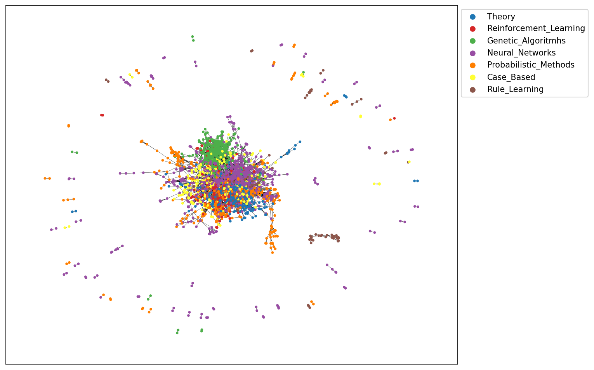
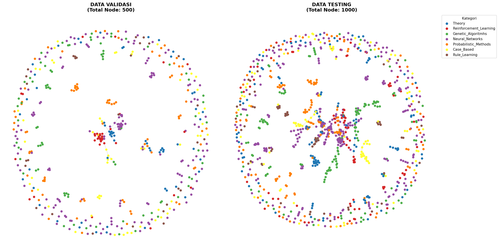
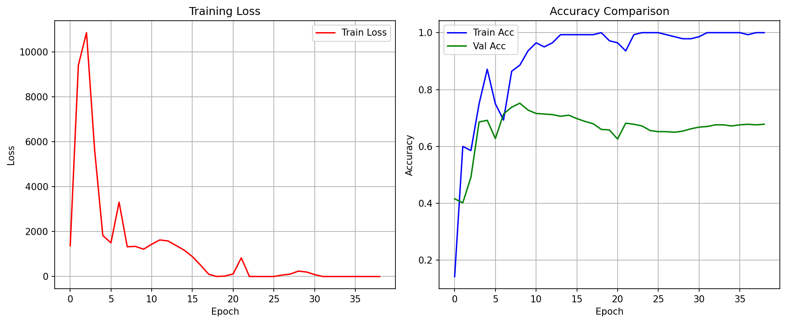
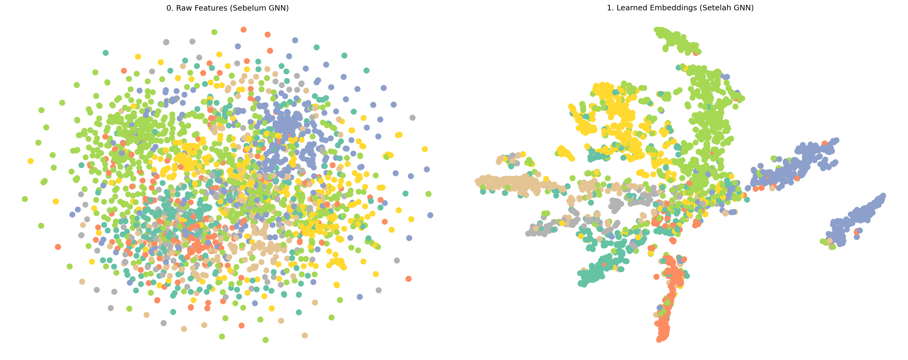

# Graph Neural Network pada Dataset Cora

Notebook ini berisi implementasi sederhana Graph Neural Network (GNN) untuk klasifikasi node pada dataset **Cora** menggunakan PyTorch Geometric.

## Isi proyek

- Demonstrasi message passing dengan penjumlahan fitur node tetangga.
- Eksperimen matriks adjacency pada dataset Cora.
- Visualisasi graph, node validasi, dan node testing menggunakan NetworkX.
- Model GNN dengan beberapa langkah message passing, residual block, batch normalization, dropout, dan ReLU.
- Pelatihan dengan Adam, early stopping, dan pemulihan bobot dengan akurasi validasi terbaik.
- Evaluasi akurasi testing, kurva training, serta visualisasi t-SNE fitur awal dan embedding hasil GNN.

## Hasil Visualisasi

### Graph Dataset Cora



### Data Validasi dan Testing



### Kurva Training



### Perbandingan Embedding dengan t-SNE



Pada salah satu eksekusi notebook, model menghasilkan validation accuracy terbaik sebesar **0.7520** dan test accuracy sebesar **0.7070**. Hasil dapat berubah bergantung pada environment dan proses training.

## Struktur

```text
.
├── GNN.IPYNB
├── README.md
├── requirements.txt
├── .gitignore
└── results/
	├── graph-cora.png
	├── validation-testing-subgraphs.png
	├── training-history.png
	└── tsne-comparison.png
```

## Persiapan

Gunakan Python 3.9 atau yang lebih baru, lalu buat virtual environment:

```bash
python -m venv .venv
```

Aktifkan environment tersebut:

Windows PowerShell:

```powershell
.venv\Scripts\Activate.ps1
```

macOS/Linux:

```bash
source .venv/bin/activate
```

Instal dependency:

```bash
python -m pip install --upgrade pip
pip install -r requirements.txt
```

PyTorch Geometric dapat memerlukan wheel PyTorch yang sesuai dengan sistem operasi, versi PyTorch, dan dukungan CUDA. Jika instalasi gagal, ikuti instruksi resmi PyTorch dan PyTorch Geometric untuk memilih versi yang cocok.

## Menjalankan notebook

```bash
jupyter notebook GNN.IPYNB
```

Jalankan sel secara berurutan. Notebook akan mengunduh dataset Cora ke `/tmp/Cora` saat pertama kali dijalankan. Pada Windows, lokasi ini biasanya dipetakan ke direktori temporary sistem.

Notebook otomatis memilih GPU CUDA jika tersedia dan menggunakan CPU jika tidak tersedia. Nilai `K=2` berarti model melakukan dua langkah message passing.

## Catatan

Sel contoh prediksi membuat `DataFrame` dengan alias `pd`, sehingga tambahkan impor berikut sebelum menjalankan sel tersebut apabila muncul `NameError`:

```python
import pandas as pd
```

Hasil akurasi dapat berbeda bergantung pada versi library, perangkat keras, dan proses training.
